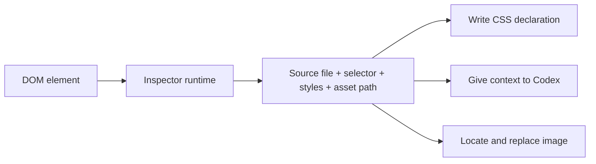

# Web No Code

**Select an element in a running Vite page, locate its source, and edit the project directly.**

[中文文档](./README.zh-CN.md)

## What This Plugin Is

`@web-no-code/vite-inspector-plugin` is a development-only visual source editor for Vite. It connects DOM elements in the browser to the Vue, React, CSS, and image files in the local workspace, turning the running page into an entry point for source edits.

When the target Vite dev server starts, the plugin automatically:

1. Injects an element inspector runtime into the page.
2. Starts the local Web No Code editor and API server.
3. Registers the workspace root, Vite URL, and path aliases.
4. Opens the target page inside the editor for element selection.

> The plugin uses `apply: "serve"` and is never injected into a production `vite build`.


## Why It Exists

The browser knows the rendered result, while development work must change source files. The missing piece is a reliable mapping between the two:

| Task                           | Required source context                                              | Common problem                                                                      |
| ------------------------------ | -------------------------------------------------------------------- | ----------------------------------------------------------------------------------- |
| Change page CSS                | Source file, selector, and declaration that produced the active rule | DevTools may only expose compiled rules or computed values                          |
| Ask Codex to change an element | Component, style source, selector, and page context                  | “Change this button” does not identify a file to Codex                              |
| Replace an image               | Original asset path, alias, filename, and real workspace location    | The browser may only expose an absolute URL, `/@fs/` URL, or transformed asset path |

**Web No Code provides this page-to-source mapping.** It does not maintain a separate browser-only design document.



The plugin combines Vite module data, source maps, CSS rules, Vue inspector metadata, the workspace root, and alias configuration to recover source context. **CSS editing, Codex editing, and asset replacement then share that context.**

***

## How To Use It

### 1. Install

The target project must use Vite 5 or newer.

```bash
pnpm add -D @web-no-code/vite-inspector-plugin
```

### 2. Configure Vite

```js
import { defineConfig } from "vite";
import vue from "@vitejs/plugin-vue";
import { webNoCodeInspector } from "@web-no-code/vite-inspector-plugin";

export default defineConfig({
  plugins: [
    vue(),
    webNoCodeInspector()
  ]
});
```

> No additional `command === "serve"` condition is needed because the plugin already limits itself to the dev server.

### 3. Start The Target Project

```bash
pnpm dev
```

**By default, the plugin starts Web No Code at `http://127.0.0.1:4317` and opens it automatically.** The editor loads the current Vite page, and source changes are written directly to the target workspace.

### 4. Edit From The Page

#### Change CSS

1. Enable the element selection tool.
2. Click an element in the target preview.
3. Edit a located declaration in CSS Rules.
4. Press `Enter` or blur the input to write it back to the source file.

Numeric values support live preview with `Arrow Up` / `Arrow Down`. Hold `Shift` for a step of `10` or `Alt` for a step of `0.1`. Absolute and fixed elements can also be dragged to update their source position.

#### Ask Codex To Change The Selected Element

1. Select the element in the page.
2. Keep its context attached in the Codex input area.
3. Describe the requested change and send it.

The request includes the selector, component or source file, style sources, and page information, avoiding target-file guesses from natural language alone. Codex settings provide two workspace modes: the default direct mode edits the target project in place, while shadow mode runs in a temporary workspace and applies the resulting diff back to the real project.

> This workflow requires a local Codex CLI. If `codex` is not on `PATH`, set `CODEX_BIN` explicitly:

```bash
CODEX_BIN=/absolute/path/to/codex pnpm --dir packages/server dev
```

#### Replace An Image

1. Select an `` or an element with `background-image`.
2. Click the image preview in the right rail.
3. For a local asset, choose a replacement file; Web No Code locates and overwrites the original file.
4. For a genuinely remote `http(s)` image, edit the URL stored in source.

Paths such as `@/assets/...`, `/src/assets/...`, Vite `/@fs/...` URLs, and absolute URLs served by the current dev server are treated as local assets. Alias configuration and the workspace root are used to recover the real file location.

## Common Controls

| Control                    | Action                                        |
| -------------------------- | --------------------------------------------- |
| `Ctrl+C`                   | Toggle element selection, except while typing |
| Hold `Option` / `Alt`      | Temporarily enable element selection          |
| `Ctrl+S`                   | Open the current source location in VS Code   |
| `Enter`                    | Send a Codex prompt or commit a CSS value     |
| `Shift+Enter`              | Insert a newline in the Codex prompt          |
| `$`                        | Open the Codex skill picker                   |
| `375px` / `750px` / `Full` | Change the target preview width               |

## Options

```js
import { WebNoCodePreviewWidth, webNoCodeInspector } from "@web-no-code/vite-inspector-plugin";

webNoCodeInspector({
  enabled: true,
  vueInspector: true,
  mobileUserAgent: true,
  autoStart: true,
  open: true,
  width: WebNoCodePreviewWidth.Width375,
  serverPort: 4317,
  workspaceRoot: process.cwd()
});
```

| Option            | Default                          | Purpose                                                         |
| ----------------- | -------------------------------- | --------------------------------------------------------------- |
| `enabled`         | `true`                           | Enable the plugin; `false` disables injection and editor startup |
| `vueInspector`    | `true`                           | Enable Vue component source lookup support                      |
| `mobileUserAgent` | `true`                           | Emulate iPhone Safari; accepts `false` or a custom UA string    |
| `autoStart`       | `true`                           | Start the Web No Code server automatically                      |
| `open`            | `true`                           | Open the editor after the server starts                         |
| `width`           | `WebNoCodePreviewWidth.Width375` | Initial target preview width: `Width375`, `Width750`, or `Full` |
| `serverPort`      | `4317`                           | Preferred local editor port                                     |
| `serverUrl`       | -                                | Connect to an existing Web No Code server                       |
| `workspaceRoot`   | `process.cwd()`                  | Root directory that source operations may access                |
| `cli`             | bundled CLI                      | Override the server command for advanced integrations           |

***

## Develop This Repository

```bash
pnpm install
pnpm dev
```

`pnpm dev` watches the server, editor, plugin, and packaged editor assets. Start the bundled Vue target in another terminal:

```bash
pnpm dev:vue
```

The demo target runs at `http://127.0.0.1:5174`; the editor defaults to `http://127.0.0.1:4317`.

Repository layout:

* `packages/vite-inspector-plugin`: Vite plugin, page runtime, and CLI.
* `packages/editor`: React visual editor.
* `packages/server`: source patches, asset replacement, and Codex bridge.
* `examples/vue-target`: local Vue target used for verification.

## Build And Release

```bash
# Typecheck and build all publishable output.
pnpm typecheck
pnpm build

# Publish the version already present in package.json.
pnpm release

# Bump and publish a new version.
pnpm release:patch
pnpm release:minor
pnpm release:major
```

The release script checks the worktree, npm authentication, and version availability before typechecking, building, publishing to npm, and creating a release commit plus a local tag. **Pushing the commit and tag remains an explicit maintainer action.**

## Boundaries

* Source operations are intended for local development only.
* Changes are written to the real workspace, so the project should be under version control.
* Dynamically generated rules, cross-origin stylesheets, or missing source maps may expose only runtime values and cannot always be mapped to the original declaration.
* Codex and VS Code integration require the corresponding local tools.
