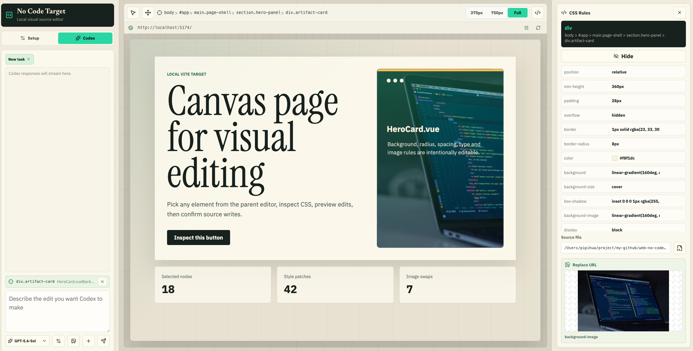

# Web No Code

**Click an element on a running Vite page, find its source, and edit it directly.**

[中文文档](./README.zh-CN.md)

## Why Use It

A page may look simple in the browser, but finding the file that controls one button, style, or image can take time. Browser DevTools shows the rendered result, while the code you need may be in a Vue component, React component, CSS file, or local asset.

Web No Code connects the page back to those source files. Select an element once, then edit its CSS, send its context to Codex, replace its image, or open the related source file.

## What It Is

`@web-no-code/vite-inspector-plugin` is a visual source editor for Vite development projects. It runs only with the Vite dev server and does not enter the production build.

After you add the plugin and start your project, it automatically opens a local editor containing your page.



## Quick Start

### 1. Install

Your project must use Vite 5 or newer.

```bash
pnpm add -D @web-no-code/vite-inspector-plugin
```

### 2. Configure Vite

```js
import { defineConfig } from "vite";
import vue from "@vitejs/plugin-vue";
import { webNoCodeInspector } from "@web-no-code/vite-inspector-plugin";

export default defineConfig({
  plugins: [vue(), webNoCodeInspector()],
  css: {
    devSourcemap: true
  }
});
```

For React projects, keep your existing React plugin and add `webNoCodeInspector()` next to it.

`css.devSourcemap` helps Web No Code find the correct source location for Vue styles, SCSS, Less, PostCSS, and nested CSS. Without it, simple styles may still work, but source lookup can be less accurate. It only affects development.

The plugin already runs only in development, so you do not need an extra `command === "serve"` check.

### 3. Start Your Project

```bash
pnpm dev
```

The plugin starts Web No Code at `http://127.0.0.1:4317` by default and opens it automatically. Changes are written directly to your project, so use Git before editing.

## Edit From The Page

For faster source lookup, give editable elements stable, unique CSS selectors and avoid deeply nested CSS. If Web No Code cannot find the original declaration reliably, press `Ctrl+S` to open the nearest source file and edit it manually.

### Select An Element

1. Click the element selection button in the top toolbar.
2. Click an element in the preview.
3. Its source and styles appear in the editor.

### Change CSS

Edit a value in the CSS Rules panel, then press `Enter` or leave the input to save it.

For numeric values, use `Arrow Up` and `Arrow Down`. Hold `Shift` to change by `10`, or `Alt` to change by `0.1`. You can also drag absolutely or fixed-positioned elements.

### Ask Codex To Make A Change

Select an element, keep its context attached in the Codex input, and describe the change. Web No Code sends the related selector, component, style source, and page information with your request.

This feature requires a local Codex CLI. If `codex` is not on `PATH`, set `CODEX_BIN`:

```bash
CODEX_BIN=/absolute/path/to/codex pnpm --dir packages/server dev
```

### Replace An Image

Select an `` or an element with `background-image`, then click its image preview in the right panel.

- For a local image, choose a replacement file.
- For a remote `http(s)` image, enter a new URL.

### Change The Preview Page

Edit the URL above the preview and press `Enter`. Use the parameter button to edit long query parameters separately, or use the refresh button to reload the current page.

## Common Controls

| Control                    | Action                                      |
| -------------------------- | ------------------------------------------- |
| `Ctrl+C`                   | Turn element selection on or off            |
| Hold `Option` / `Alt`      | Temporarily select elements                 |
| `Ctrl+S`                   | Open the nearest source in VS Code          |
| `Enter`                    | Send a Codex prompt or save a CSS value     |
| `Shift+Enter`              | Add a new line to a Codex prompt            |
| `$`                        | Open the Codex skill picker                 |
| `375px` / `750px` / `Full` | Change the preview width                    |

## Plugin Options

```js
import { WebNoCodePreviewWidth, webNoCodeInspector } from "@web-no-code/vite-inspector-plugin";

webNoCodeInspector({
  enabled: true,
  vueInspector: true,
  open: true,
  width: WebNoCodePreviewWidth.Width375,
  serverPort: 4317,
  workspaceRoot: process.cwd()
});
```

| Option          | Default                          | Description                              |
| --------------- | -------------------------------- | ---------------------------------------- |
| `enabled`       | `true`                           | Enable or disable the plugin             |
| `vueInspector`  | `true`                           | Locate Vue component source              |
| `open`          | `true`                           | Open the editor automatically            |
| `width`         | `WebNoCodePreviewWidth.Width375` | Initial preview width                    |
| `serverPort`    | `4317`                           | Preferred local editor port              |
| `workspaceRoot` | `process.cwd()`                  | Project directory that may be edited     |

## Before You Use It

- Web No Code is intended for local development only.
- It edits real project files. Keep the project under version control.
- Generated styles, cross-origin stylesheets, and missing source maps may prevent exact source lookup.
- Codex and VS Code features require those tools to be installed locally.

## Develop This Repository

```bash
pnpm install
pnpm dev
```

Start the Vue demo in another terminal:

```bash
pnpm dev:vue
```

The demo runs at `http://127.0.0.1:5174`, and Web No Code runs at `http://127.0.0.1:4317` by default.

```bash
pnpm typecheck
pnpm build
```
