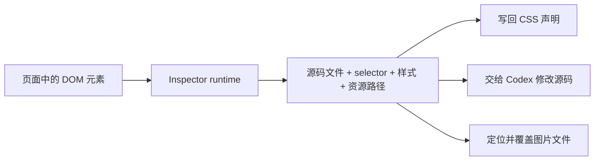

# Web No Code

**直接在正在运行的 Vite 页面上选择元素、定位源码并完成修改。**

[English README](./README.md)

## 这个插件是什么

`@web-no-code/vite-inspector-plugin` 是一个只在 Vite 开发服务器中运行的可视化源码编辑插件。它把浏览器里的 DOM 元素与本地项目中的 Vue、React、CSS 和图片文件连接起来，让页面不只是预览结果，也成为源码编辑入口。

接入插件后，启动业务项目的 `vite dev server` 会自动：

1. 向页面注入元素检查 runtime。
2. 启动本地 Web No Code 编辑器和 API 服务。
3. 注册业务项目根目录、Vite 地址和路径别名。
4. 在编辑器中打开业务页面，允许从页面选择元素。

> 插件使用 `apply: "serve"`，不会注入 `vite build` 的生产产物。


## 为什么有这个插件

浏览器擅长展示最终结果，但开发修改需要回到源码。两者之间缺少稳定的对应关系：

| 要做的事           | 真正需要知道的信息                      | 常见问题                                      |
| -------------- | ------------------------------ | ----------------------------------------- |
| 修改页面 CSS       | 生效规则所在的源码文件、选择器和声明位置           | DevTools 看到的是编译后或 computed style，不一定是原始声明 |
| 让 Codex 修改某个元素 | 元素对应的组件、样式文件、selector 和当前页面上下文 | 只描述“改这个按钮”时，Codex 不知道“这个”对应哪个文件           |
| 替换图片           | 原始资源路径、路径别名、文件名和工作区中的实际位置      | 浏览器里常常只剩绝对 URL、`/@fs/` 地址或构建后的资源路径        |

**Web No Code 解决的是“从页面回到源码”这一层**，而不是在浏览器中维护一份脱离项目的样式数据。



插件结合 Vite 模块信息、source map、CSS rules、Vue inspector 信息、项目根目录和 alias 配置恢复源码上下文。定位成功后，**CSS 编辑、Codex 编辑和图片替换共用同一份元素上下文。**

***

## 怎么使用

### 1. 安装

要求业务项目使用 Vite 5 或更高版本。

```bash
pnpm add -D @web-no-code/vite-inspector-plugin
```

### 2. 配置 Vite

```js
import { defineConfig } from "vite";
import vue from "@vitejs/plugin-vue";
import { webNoCodeInspector } from "@web-no-code/vite-inspector-plugin";

export default defineConfig({
  plugins: [
    vue(),
    webNoCodeInspector()
  ]
});
```

> 插件本身已经限制为开发服务器模式，不需要额外判断 `command === "serve"`。

### 3. 启动业务项目

```bash
pnpm dev
```

**插件默认启动 `http://127.0.0.1:4317` 并自动打开编辑器。** 编辑器中加载的是当前业务 Vite 页面，源码修改直接写入当前业务项目。

### 4. 从页面修改源码

#### 修改 CSS

1. 开启顶部的元素选择工具。
2. 在预览页面点击要修改的元素。
3. 在 CSS Rules 中修改已定位到的声明。
4. 按 `Enter` 或让输入框失焦，将结果写回源码文件。

数值属性支持 `Arrow Up` / `Arrow Down` 实时预览；按住 `Shift` 时步长为 `10`，按住 `Alt` 时步长为 `0.1`。对于 absolute 或 fixed 元素，也可以直接拖动并写回位置。

#### 使用 Codex 修改选中元素

1. 在页面中选中元素。
2. 在 Codex 输入区保留选中元素上下文。
3. 描述希望完成的修改并发送。

请求会携带元素 selector、组件或源码文件、样式来源和页面信息，避免只凭自然语言猜测目标文件。Codex 设置支持两种工作区模式：默认的 direct 模式直接修改业务项目；shadow 模式先在临时工作区执行，再将产生的 diff 应用到真实项目。

> 该功能依赖本机可用的 Codex CLI。若 `codex` 不在 `PATH` 中，可以通过 `CODEX_BIN` 指定：

```bash
CODEX_BIN=/absolute/path/to/codex pnpm --dir packages/server dev
```

#### 替换图片

1. 选中 `` 或带 `background-image` 的元素。
2. 点击右侧图片预览。
3. 本地资源选择新图片后，插件会定位并覆盖原文件。
4. 真正的远程 `http(s)` 图片则通过 URL 输入框修改源码链接。

`@/assets/...`、`/src/assets/...`、Vite 的 `/@fs/...` 以及指向当前开发服务器的绝对 URL 都按本地资源处理。插件会结合 alias 和工作区根目录恢复实际文件位置。

## 常用操作

| 操作                         | 行为                      |
| -------------------------- | ----------------------- |
| `Ctrl+C`                   | 开关元素选择工具；输入框聚焦时不触发      |
| 长按 `Option` / `Alt`        | 临时开启元素选择，松开后恢复          |
| `Ctrl+S`                   | 在 VS Code 中打开当前源码位置     |
| `Enter`                    | 发送 Codex 输入，或提交 CSS 输入值 |
| `Shift+Enter`              | 在 Codex 输入框中换行          |
| `$`                        | 打开 Codex skill 选择器      |
| `375px` / `750px` / `Full` | 切换目标页面预览宽度              |

## 配置项

```js
import { WebNoCodePreviewWidth, webNoCodeInspector } from "@web-no-code/vite-inspector-plugin";

webNoCodeInspector({
  enabled: true,
  vueInspector: true,
  mobileUserAgent: true,
  autoStart: true,
  open: true,
  width: WebNoCodePreviewWidth.Width375,
  serverPort: 4317,
  workspaceRoot: process.cwd()
});
```

| 参数                | 默认值                              | 说明                                       |
| ----------------- | -------------------------------- | ---------------------------------------- |
| `enabled`         | `true`                           | 是否启用插件；`false` 时不注入页面且不启动编辑器          |
| `vueInspector`    | `true`                           | 是否启用 Vue 组件源码定位支持                        |
| `mobileUserAgent` | `true`                           | 模拟 iPhone Safari；可传 `false` 或自定义 UA 字符串  |
| `autoStart`       | `true`                           | 是否自动启动 Web No Code 服务                    |
| `open`            | `true`                           | 服务启动后是否自动打开编辑器                           |
| `width`           | `WebNoCodePreviewWidth.Width375` | 初始预览宽度，可选 `Width375`、`Width750` 或 `Full` |
| `serverPort`      | `4317`                           | 本地编辑器服务首选端口                              |
| `serverUrl`       | -                                | 连接已经运行的 Web No Code 服务                   |
| `workspaceRoot`   | `process.cwd()`                  | 允许读取和修改的业务项目根目录                          |
| `cli`             | 内置 CLI                           | 自定义服务启动命令，适合高级集成                         |

***

## 在本仓库开发

```bash
pnpm install
pnpm dev
```

`pnpm dev` 会同时监听 server、editor、plugin 和插件静态资源。另开一个终端启动内置 Vue 示例：

```bash
pnpm dev:vue
```

示例页面默认运行在 `http://127.0.0.1:5174`，Web No Code 编辑器默认运行在 `http://127.0.0.1:4317`。

仓库结构：

* `packages/vite-inspector-plugin`：Vite 插件、页面 runtime 和 CLI。
* `packages/editor`：React 可视化编辑器。
* `packages/server`：源码补丁、资源替换和 Codex bridge。
* `examples/vue-target`：用于本地验证的 Vue 示例项目。

## 构建与发布

```bash
# 类型检查和完整构建
pnpm typecheck
pnpm build

# 发布当前 package.json 中的版本
pnpm release

# 升级版本后发布
pnpm release:patch
pnpm release:minor
pnpm release:major
```

release 脚本会检查工作区、npm 登录状态和版本是否已存在，然后执行类型检查、构建、npm publish，并创建 release commit 和本地 tag。**推送 commit 和 tag 仍由发布者显式执行。**

## 使用边界

* 所有源码操作仅用于本地开发环境。
* 修改会写入真实工作区，使用前应由 Git 管理项目文件。
* 动态生成、跨域样式表或缺少 source map 的规则可能只能显示运行时值，无法保证定位到原始声明。
* Codex、VS Code 打开源码等能力依赖对应的本地工具可用。
